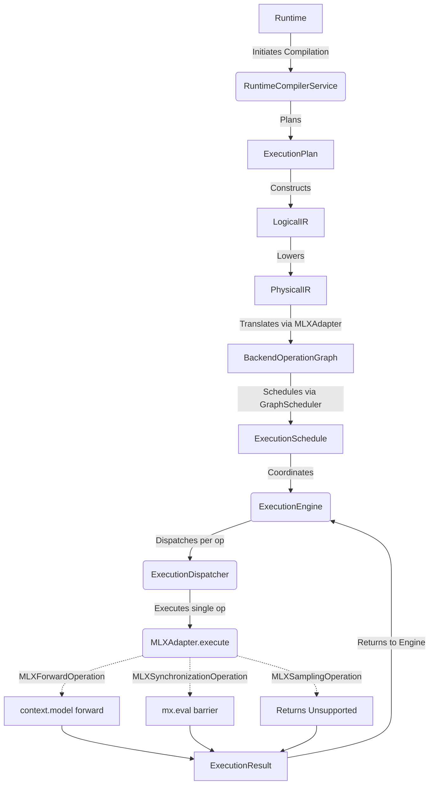

# Execution Flow Diagram

The target architecture enforces strict separation of concerns, ensuring that the backend adapter handles only physical execution and not scheduling or state management.

### Flow Walkthrough

1. The `RuntimeCompilerService` takes a request and runs it through the capability resolver, planner, and IR builder to produce a `PhysicalIR`.
2. The `MLXAdapter` performs static translation (ahead-of-time) of the `PhysicalIR` into a `BackendOperationGraph`.
3. The `GraphScheduler` sequences the operations from the graph into an `ExecutionSchedule`.
4. The `ExecutionEngine` iterates over the schedule. For each scheduled operation, it delegates to the `ExecutionDispatcher`.
5. The `ExecutionDispatcher` calls `MLXAdapter.execute(operation, context)`.
6. The `MLXAdapter` acts solely as a kernel dispatcher, using lightweight references from the `ExecutionContext` (such as the model instance) to execute the specific operation. It does not own the model lifecycle or generation loop.
