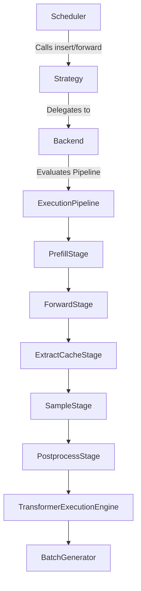
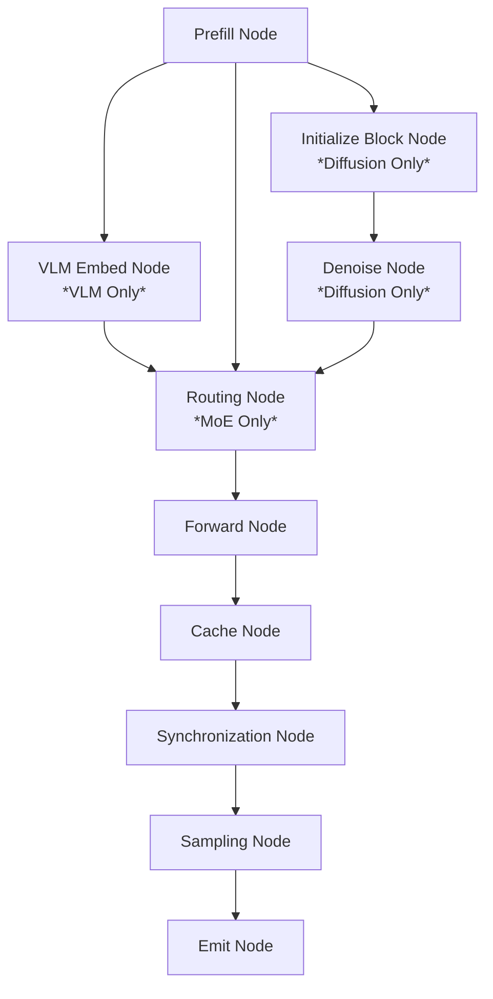
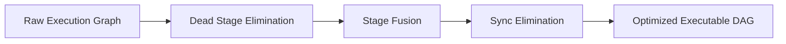
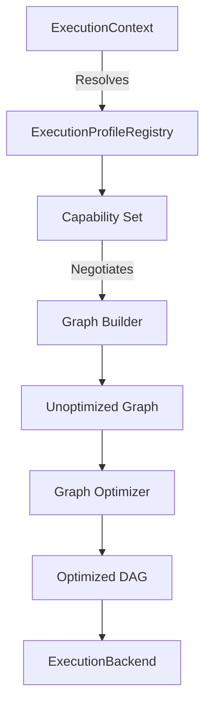
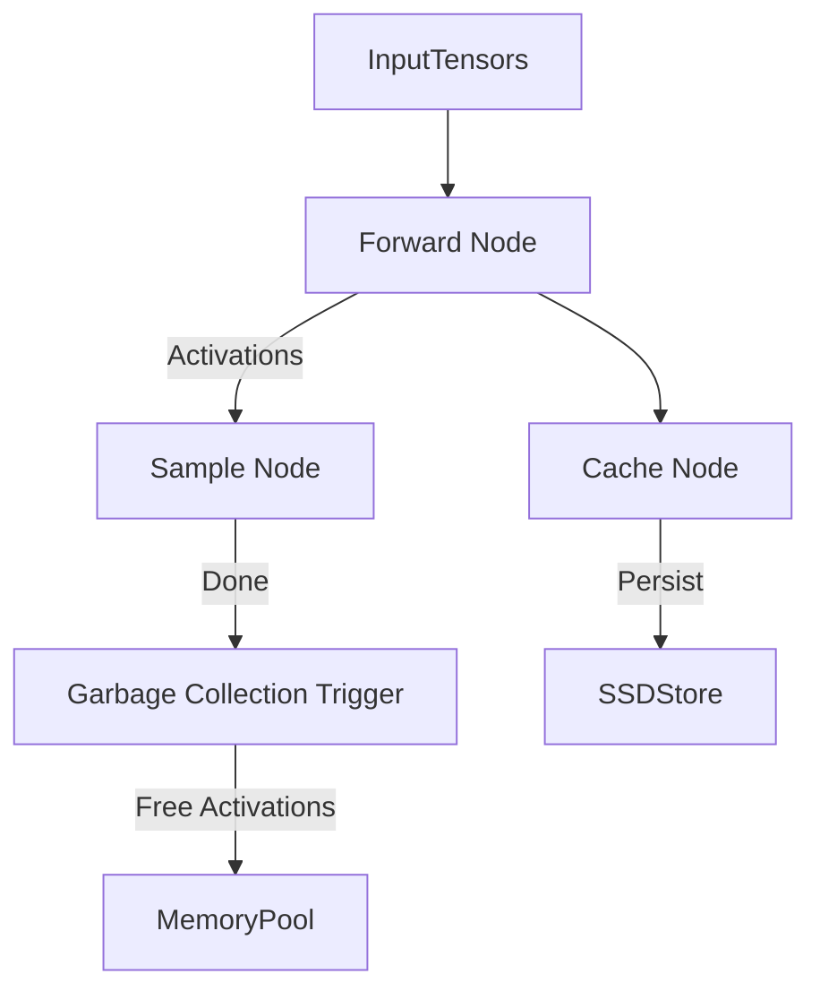
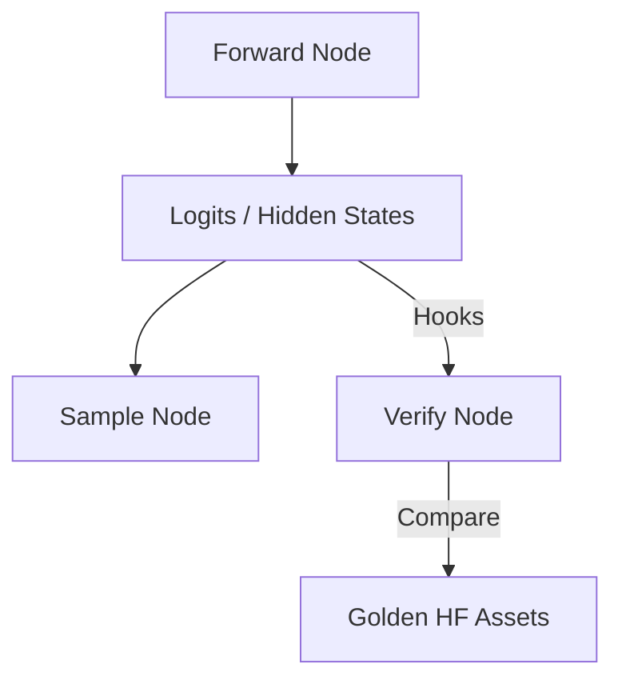

# RAES-011: Execution Graph & Runtime Optimizer Architecture

## Objective
Perform a complete repository audit and design a graph-based execution architecture that allows runtime execution to be represented as a directed acyclic graph (DAG) of execution stages. The architecture must support future optimization passes without changing Scheduler logic.

---

## 1. Repository Audit

A full repository audit locates the following execution boundaries and logic points:

*   **Execution Stages:** Found in `omlx/inference/execution_backend.py`. E.g., `PrefillStage`, `ForwardStage`, `ExtractCacheStage`. These currently map to a linear pipeline sequence.
*   **Backend Execution Flow:** Managed via `ExecutionBackend` wrappers (e.g., `AutoregressiveBackend`, `ExperimentalNemotronBackend`) that execute `ExecutionPipeline` instances state by state.
*   **Pipeline Stages:** Outlined via `PipelineState` enum: `INITIALIZED`, `PREPARED`, `RUNNING`, `SYNCING`, `FINALIZED`, `CLEANED`.
*   **Scheduler Transitions:** Found in `omlx/scheduler.py` managing state queues: Waiting → Prefilling → Running (via MLX-LM `BatchGenerator`) → Finished.
*   **Synchronization Points:** `mx.eval()` called explicitly in `omlx/inference/strategy.py` and `_sync_and_clear_cache()`, `_safe_sync_stream()` in `scheduler.py` before batch boundaries.
*   **Cache Extraction:** Managed via `store_cache()` asynchronously, and `_extract_cache_states` dict.
*   **Cache Evaluation:** Managed by `block_aware_cache` checks and policy evaluation in `omlx/inference/cache_policy.py`.
*   **Forward Execution:** Executed inside `TransformerExecutionEngine` and `NemotronExecutionEngine`, calling the MLX model or generator directly.
*   **Sampling:** Handled via `make_sampler_interface` utilizing `SamplerParams` located in `omlx/inference/sampler_interface.py` and `omlx_make_sampler`.
*   **Detokenization:** Token detokenization exists implicitly in `PostprocessStage` handling outputs.
*   **Speculative Execution:** Outlined in `omlx/inference/strategies/linear_speculation.py` via `build_linear_speculation_graph()`.
*   **Diffusion Execution:** Defined in `omlx/inference/strategies/diffusion.py` and backend `experimental_diffusion_backend.py`.
*   **VLM Execution:** Specific logic for embedding vision inputs (`request.vlm_inputs_embeds`, `rope_deltas`) exists in `scheduler.py` and `engine/vlm.py`.
*   **MoE Routing:** Evidence of custom Metal kernels for MoE DSA routing exist in `omlx/custom_kernels/glm_moe_dsa/csrc/mlx/backend`.
*   **Verification Checkpoints:** Found context clues for `omlx/eval/` directory and Golden asset comparisons that can hook into graph state outputs.

---

## 2. Current Execution Mapping

The current execution architecture acts as a strictly layered, linear abstraction:

```
Scheduler
   ↓  (Calls step(), manages queues)
GenerationStrategy
   ↓  (Autoregressive, Diffusion, LinearSpeculation)
ExecutionBackend
   ↓  (AutoregressiveRuntime mapping abstract states)
ExecutionPipeline
   ↓  (Iterates list[ExecutionStage] sequentially)
ExecutionEngine
   ↓  (TransformerExecutionEngine wrappers)
BatchGenerator / Runtime
   ↓  (mlx-lm next_generated(), mx.eval())
Response
```

**Comparison against Proposed Graph Architecture:**
Currently, `ExecutionGraph` (in `omlx/inference/execution_graph.py`) defines a pseudo-graph using `GraphNode` (`next_nodes`), but traversal acts strictly linearly via `linear_order()`. The proposed architecture will replace `ExecutionPipeline`'s linear stage array with a true DAG evaluator capable of branching, dependency resolution, and node fusion.

---

## 3. Execution Graph Architecture

An execution graph replaces linear pipelines with a DAG of nodes. Based on `GraphNodeType` and backend audits, the taxonomy is:

*   **Capability Resolution Node:** Decides if graph falls back to AR based on context.
*   **Input Node (Prefill Node):** Prepares batch inputs, embedding injections (VLM).
*   **Cache Node (ExtractCache Node):** Manages KV updates.
*   **Routing Node:** Defines MoE routing kernels.
*   **Forward Node:** Standard model MLP/Attention forward pass.
*   **Sampling Node:** Logit processing and next token selection.
*   **Draft Node & Accept Node:** Speculative components.
*   **Denoise Node & Initialize Block Node:** Diffusion components.
*   **Synchronization Node:** Barrier nodes ensuring `mx.eval()` execution.
*   **Decode/Emit Node:** Emits tokens and metrics.

**Graph Edges Enforcement:**
*   **Execution Dependency Edges:** Structural order (e.g., `ForwardNode` → `SampleNode`).
*   **Data Flow Edges:** Explicit mapping of output tensors to input parameters (e.g., Logits → Sampler).
*   **Synchronization Edges:** Forces streams to sync before cache modifications.
*   **Cache Dependency Edges:** Guarantees KV writes resolve before subsequent forwards.
*   **Verification Edges:** Branches off main compute path for debug validation.
*   *Ordering Enforcement:* Handled by a Topological Sort executed by the graph runtime evaluator.

---

## 4. Runtime Optimizer Design

Graph execution enables AOT optimization passes before runtime execution.

**Feasible Passes from Repository Evidence:**
1.  **Dead Stage Elimination:** If `hot_cache_only` is true and cache is hit, skip unnecessary KV updates.
2.  **Stage Fusion:** Combine `Forward` and `Sample` if supported by hardware kernels.
3.  **Synchronization Elimination:** Defer intermediate `mx.eval()` calls until required by an `EmitNode` or memory bound.
4.  **Graph Simplification:** Collapse empty speculative verification branches if confidence models dictate auto-accept.
5.  **Capability-Aware Optimization:** Strip `Routing Node` if model is dense.

---

## 5. Execution Planner

Transforms configurations into executable code via:

1.  **Execution Profile:** `ExecutionContext` mapped by `ExecutionProfileRegistry`.
2.  **Capability Set:** Capability negotiation (e.g., if Diffusion profile requested but not supported, fallback to AR).
3.  **Execution Graph Construction:** Graph builder instantiates unoptimized DAG nodes based on profile.
4.  **Optimized Graph:** Optimizer applies feasible passes (fusion, elimination).
5.  **Runtime Execution:** DAG is handed to backend for topological evaluation.

---

## 6. Multi-Capability Support

Because the `Scheduler` only calls `strategy.forward()` or `strategy.insert()`, it remains agnostic to *how* the execution completes. The graph abstracts complex behaviors:

*   **Autoregressive:** `Prefill -> Forward -> Sample -> Emit`
*   **Diffusion:** `Prefill -> Init Block -> Denoise Loop -> Forward -> Emit`
*   **Streaming MoE:** Inserts `Routing Node` prior to `Forward Node`.
*   **VLM:** Prepends `VLM Embed Node` to `Prefill Node`.
*   **Future Capabilities:** New nodes can be registered in `GraphNodeType` and executed dynamically without touching `omlx/scheduler.py`.

---

## 7. Memory Scheduling Design

Graph-aware memory execution handles constraints predictably:

*   **Cache Ownership:** KV cache arrays belong to graph outputs.
*   **Activation Lifetime:** Graph nodes explicitly track inputs; tensors are deleted instantly when a node's topological dependents complete.
*   **KV Cache Reuse:** Match prefix sub-graphs prior to execution.
*   **Garbage Collection Boundaries:** `Memory Nodes` placed at end-of-graph trigger safe `mx.clear_cache()` outside async MLX overflows.

---

## 8. Hardware Integration

*   **Metal Optimization:** Node executions lower directly to MLX stream operations (`mx.eval`).
*   **CPU Fallback:** Nodes encapsulate operations. If a custom node fails, graph falls back to generic node.
*   **Heterogeneous Execution:** Potential to label nodes with target devices (e.g., execute `VLM Embed Node` on Neural Engine, `Forward Node` on GPU).

---

## 9. Verification Integration

Verification seamlessly plugs into DAG logic.
*   **Integration:** A `Verify Node` attaches to the output edge of a `Forward Node`.
*   **Equivalence:** Evaluates tensor outputs against Golden HF datasets in `omlx/eval/`.
*   **Cleanliness:** When verification is disabled, the optimizer removes the `Verify Node` entirely, causing zero runtime pollution.

---

## 10. Repository Changes

Based on current repository structure constraints:

**NEW FILES:**
*   `omlx/inference/graph_optimizer.py`
*   `omlx/inference/graph_builder.py`
*   `omlx/inference/execution_node.py`

**MODIFIED FILES:**
*   `omlx/inference/execution_graph.py` (Enhance DAG logic beyond `linear_order`).
*   `omlx/inference/execution_backend.py` (Modify `ExecutionPipeline` to evaluate DAGs instead of arrays).

**UNTOUCHED FILES:**
*   `omlx/scheduler.py` (Zero changes, strict requirement).
*   `omlx/engine_core.py` (Remains coordinator).

---

## 11. Risk Analysis

*   **Graph Complexity:** Debugging asynchronous graph state machines is inherently harder than debugging linear arrays.
*   **Optimization Correctness:** Aggressive fusion or sync elimination could lead to MLX Stream underflows (similar to bugs noted in `scheduler.py`).
*   **Scheduler Compatibility:** Although Scheduler logic doesn't change, graph evaluation must respect timing constraints (e.g., TTFT SLAs).

---

## 12. Verification Plan

*   **Graph Construction:** Unit tests verifying topologies (e.g., diffusion has denoise loops).
*   **Execution Equivalence:** Golden test: ensure Output(Linear) == Output(Graph) for 1000 fixed seeds.
*   **Determinism:** Verify topological sorts are stable across identical runs.
*   **Cache Correctness:** Assert that Prefix KV nodes do not leak.

---

## 13. Rollback Strategy & Recommendation

**Rollback Strategy:** Feature flag `USE_GRAPH_EXECUTOR`. Retain the existing `ExecutionPipeline` list logic as fallback.
**Recommendation for Implementation Checkpoint:** Begin by refactoring `omlx/inference/execution_graph.py` to support true topological traversal and implement a `GraphExecutor` alongside the current `ExecutionPipeline`. Prove exact semantic equivalence on the Autoregressive profile before migrating speculative or diffusion paths.

---

## 14. Diagrams

### 1. Current Execution Architecture (Linear)


### 2. Graph Execution Architecture (DAG)


### 3. Graph Optimization Pipeline


### 4. Execution Planner


### 5. Memory Scheduling Graph


### 6. Verification Integration


### 7. Hardware Abstraction Graph
```mermaid
graph TD
    Node[Execution Node] -->|Capability Check| HW
    HW{Target Device}
    HW -->|Default| Metal[Metal / GPU]
    HW -->|Fallback| CPU[CPU]
    HW -->|Future| NPU[Neural Engine]
