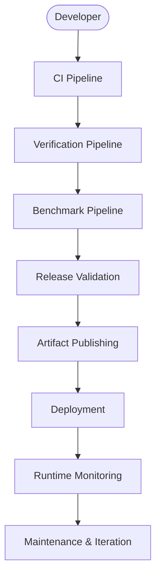
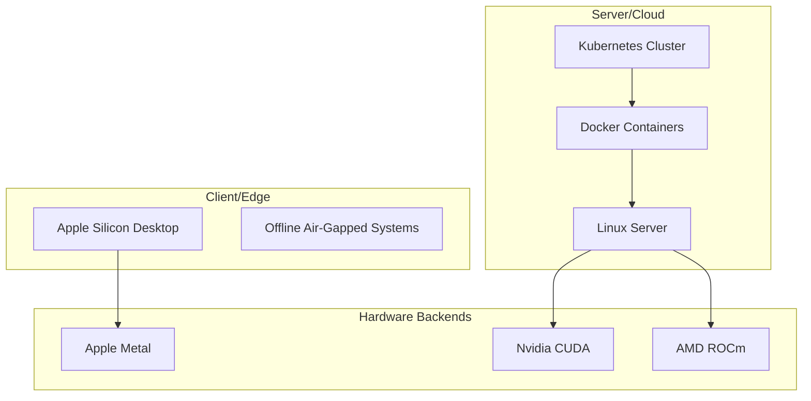
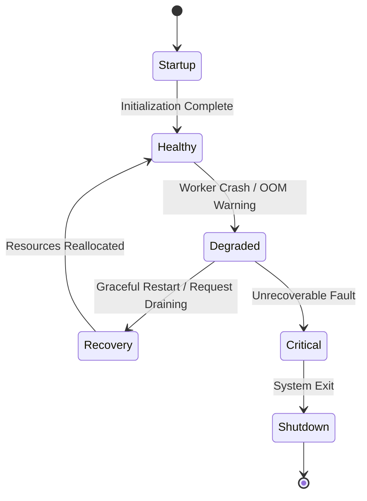
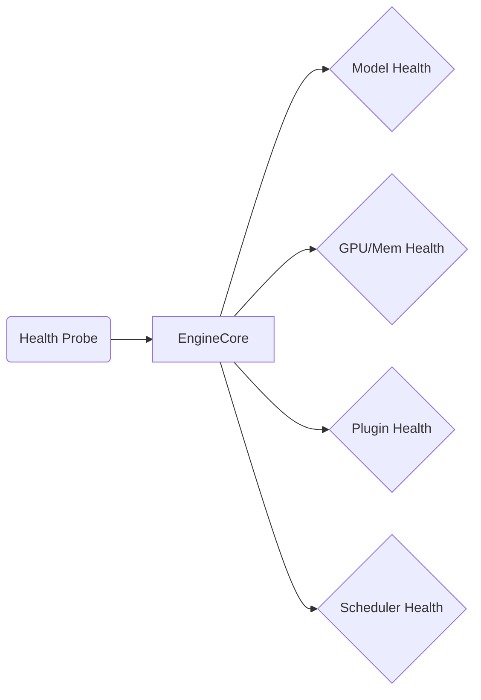
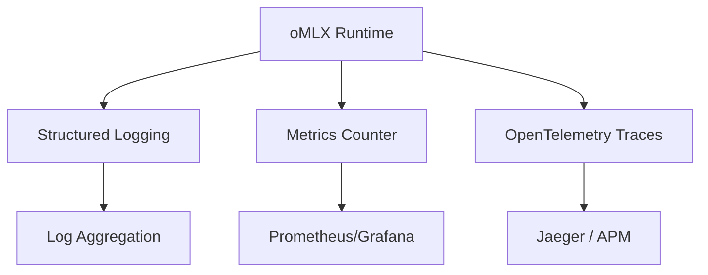
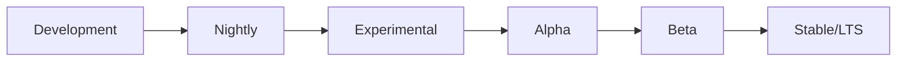
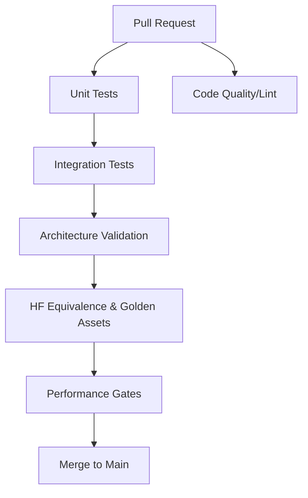
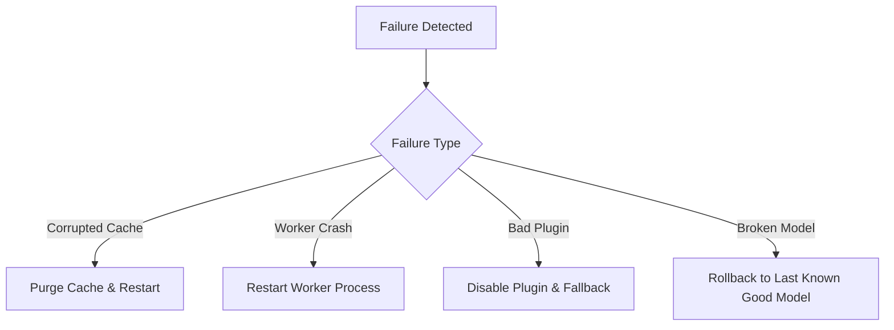
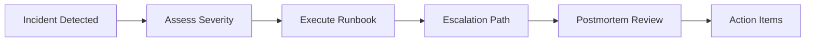

# RAES-016 — Production Readiness, Operations & Release Architecture

## Context
The oMLX architecture is largely complete, establishing the core execution flows, capability registries, plugin subsystems, and architectural constraints. RAES-016 does not redefine the runtime. It defines how oMLX is operated safely in production, serving as the operational handbook for deploying, maintaining, verifying, monitoring, benchmarking, releasing, and recovering oMLX in real-world environments.

---

## 1. Production Readiness Audit
A successful production deployment of oMLX requires transitioning from development assumptions to production rigor.

### Identified Areas:
*   **Production Assumptions**: Resources must be bounded; hardware capabilities are immutable at startup (via `ExecutionEnvironment`); configurations load deterministically.
*   **Development Assumptions**: Overly verbose logging, lazy model downloads without checksum verification, and implicit global states (like `_server_state`) are removed.
*   **Debugging Code**: Debugging endpoints must be disabled or guarded behind strict authentication in production.
*   **Feature Flags**: Defined via the `CapabilityRegistry` (e.g., `OMLX_USE_NEW_RESOLVER`) to allow safe rollout of new execution paths (e.g., Streaming MoE) alongside stable features.
*   **Logging & Metrics**: Shift from unstructured print statements to structured JSON logging (e.g., `structlog`) and metrics via OpenTelemetry integration.
*   **Health Endpoints**: Must differentiate between API liveness, model readiness (health), and worker capacity.
*   **Configuration Loading**: Strict precedence established (Env Vars > CLI > API > Config Files > Profiles > Defaults).
*   **Benchmark Tooling**: Moving from local scripts to automated CI benchmark gates.
*   **Profiling Tools**: Memory and GPU usage profiling should be opt-in, not continuously active, to minimize overhead.
*   **CI Integration & GitHub Workflows**: Shift from simple unit tests to multi-stage CI pipelines encompassing HF Equivalence, golden asset verification, and performance bounds.
*   **Release Tooling, Packaging, & Installation Scripts**: Move from source-based ad-hoc installs to versioned artifacts, PyPI packages, Docker images, and Homebrew formulae.
*   **Dependency Management**: Deterministic dependency locking for MLX, transformers, and FastAPI.

### Production Readiness Matrix
| Component | Development State | Production State | Gap to Close |
| :--- | :--- | :--- | :--- |
| **Model Fetching** | Dynamic HF Hub downloads | Pre-fetched, cached, hash-verified | Implement strict offline/verified model loading |
| **Telemetry** | stdout / print | OpenTelemetry, Structured Logs | Add OTel exporter, standardize log context |
| **Hardware Constraints** | Assumed unlimited | Bounded by `ExecutionEnvironment` limits | Enforce Memory Budgeting and backpressure |
| **Startup** | Single thread blocking | Parallel pre-flight, lazy capability eval | Optimize Plugin initialization times |

---
## 2. SLO / SLA Definition

Operational teams measure oMLX production objectives against Service Level Objectives (SLOs).

| Objective | Target | Notes |
| :--- | :--- | :--- |
| **Availability** | 99.9% | Uptime of the core inference worker |
| **TTFT (Time To First Token)** | <300 ms | Measured at the 95th percentile |
| **Latency (P95)** | <1.5 s | End-to-end request latency |
| **Crash Recovery** | <30 s | Time for worker to restart and serve traffic |
| **Deployment Rollback** | <5 min | Time to revert to previous image/adapter |

---

## 3. Operational Architecture

The operational architecture defines the lifecycle from code to production execution.

---

## 4. Deployment Architecture

oMLX targets various deployment topologies, prioritizing Apple Silicon but retaining future-proof flexibility.

### Deployment Strategies:
*   **Local Development**: Requirements: macOS/Linux, Python 3.10+. Supported: All features. Limitations: Single node.
*   **Apple Silicon Desktop**: Recommended config: M2/M3/M4 Max/Ultra. High memory bandwidth is crucial. Full MLX support.
*   **Linux Server / CUDA / ROCm**: Requirements: Fallback to PyTorch/XLA if MLX not available (or future MLX Linux support).
*   **Docker / Kubernetes**: Requirements: Containerized runtime. Supports stateless autoscaling. Resource limits must map to `ExecutionEnvironment` budgets.
*   **Distributed Cluster / Cloud**: Distributed inference via future remote worker plugins.
*   **Offline Air-Gapped**: Requires pre-downloaded Model Adapters, weights, and configurations. No dynamic Hub fetching permitted.

---

### Upgrade Strategy:
When moving to Docker/Kubernetes, deployments follow:
1.  **Canary**: Route 5% of traffic to the new version.
2.  **Blue/Green**: Full deployment of new version alongside old, switch load balancer.
3.  **Rolling**: Incrementally replace worker nodes.
4.  **Full Rollout**: 100% traffic on the new version.

---

## 5. Runtime Reliability

Supervision and recovery ensure the inference server remains available despite partial failures.

### Key Mechanisms:
*   **Worker Supervision**: An outer process or orchestration layer (like Kubernetes/systemd) supervises the oMLX process. Internally, the `EnginePool` supervises `EngineCore` instances.
*   **Graceful Shutdown & Request Draining**: Stop accepting new requests, finish executing active batches, clean up KV caches, and exit cleanly.
*   **Crash Recovery**: Terminate stuck inference loops (timeout policy), clear corrupted Metal memory, and restart the worker.
*   **Partial Failure Handling**: If an optional Plugin fails initialization, mark it degraded but continue serving core inference (if configured to tolerate it).
*   **Retry & Timeout Policies**: Configured at the API routing layer; failed requests return a 503 rather than holding connections indefinitely.

---

## 6. Health Monitoring

Differentiating between subsystem health states allows orchestrators to route traffic intelligently.

### Defined States:
*   **Healthy**: System is ready and operating within standard latency/memory bounds.
*   **Warning**: System is functional but nearing memory capacity or experiencing elevated P99 latency.
*   **Critical**: Deadlock, persistent OOM, or hardware failure. Requires restart.
*   **Recovery**: System is actively draining requests or reloading a model. Not accepting new traffic.

---

## 7. Observability Architecture

Observability provides deep visibility without degrading inference throughput.

### Components:
*   **Metrics**: Track TTFT (Time To First Token), TPS (Tokens Per Second), Latency (P50/P95/P99), Cache Hit Rate, Scheduler Overhead.
*   **Tracing**: Trace the lifecycle of a request from API -> Scheduler -> Execution Planner -> Backend -> Response.
*   **Diagnostics**: Crash dumps capture the `ExecutionEnvironment` and `ExecutionGraph` to diagnose failed executions.

---

## 8. Performance Architecture

Production benchmarking must be continuous.

### Tracked Metrics (Operational):
*   **Throughput & Latency**: TTFT, TPS, end-to-end latency, Requests/sec, Concurrent sessions.
*   **Resource Utilization**: Peak Memory, GPU/CPU Utilization.
*   **System Health**: Queue depth, Cache eviction rate, OOM events, Engine restart count, Plugin failures, Verification failures, Adapter failures.
*   **Overhead**: Scheduler queueing time, Execution Pipeline traversal time, IR Optimization Cost, Plugin Initialization Cost.

### Cost Monitoring (Cloud/Enterprise):
*   GPU utilization efficiency
*   RAM efficiency
*   Tokens per watt
*   Tokens per dollar

---

## 9. Capacity Planning

*   **Memory Budgeting**: The system calculates total available RAM and reserves a fixed percentage for KV cache, model weights, and OS overhead, enforcing strict backpressure when bounds are reached.
*   **Queue Sizing**: Maximum queue depth prevents unbounded memory growth from pending requests.
*   **Autoscaling**: Rely on metrics (e.g., active queue depth) exported to K8s HPA to scale stateless replicas.

---

## 10. Security Architecture

*   **Plugin Trust Model**: Plugins must be explicitly registered and ideally signed.
*   **Model Validation**: Models loaded from disk must match expected SHA256 hashes to prevent execution of tampered tensors.
*   **Configuration Validation**: Strict parsing of inputs (e.g., Pydantic models) to prevent injection attacks at the API layer.
*   **Sandboxing**: Limit file system access to the defined model cache directories.

---

## 11. Release Engineering

### Support Windows:
*   **Experimental**: 1 release (Best-effort support for new architectures).
*   **Stable**: 3 releases (Actively maintained, bug fixes).
*   **LTS (Long Term Support)**: 12 months (Critical fixes only).
*   **Security**: 18 months (Patches for CVEs).

### Promotion Criteria:
*   To Beta: Feature complete, passes HF Equivalence, no critical bugs.
*   To Stable: Proven under benchmark loads, documentation complete, passes all CI regression gates.

---

## 12. CI/CD Architecture

Gates include Model Adapter validation, Execution Graph generation checks, and Plugin compatibility testing.

---

## 13. Distribution Architecture

oMLX artifacts are distributed via:
*   **PyPI**: Standard `pip install omlx` (Source/Wheel).
*   **Docker**: Pre-configured environments (`ghcr.io/omlx/...`).
*   **Homebrew**: `brew install omlx` for macOS native execution.
*   **GitHub Releases**: Pre-compiled binary bundles.

---

## 14. Disaster Recovery

Partial deployments are automatically rolled back if health checks fail to reach 'Healthy' within a grace period.

---

### Backup Strategy
Alongside disaster recovery, stateful components require regular backups:
*   **Configuration Backups**: Store GitOps state of deployment manifests.
*   **Verification Baseline Backups**: Preserve golden assets and baseline logs.
*   **Registry Backups**: Back up `CapabilityRegistry` states, local Model Registry indices, and Plugin Registry metadata.

---

## 15. Incident Response

Operational issues follow a structured incident response lifecycle:

*   **Severity**: Define severity levels (e.g., SEV-1: Complete Outage, SEV-2: Degraded Performance).
*   **Runbook**: Operators execute predefined actions based on alerts.
*   **Postmortem**: Root Cause Analysis (RCA) to prevent recurrence, documenting any new constraints for the `ExecutionEnvironment`.

---

## 16. Maintenance Strategy

*   **Cache Cleanup**: Automated scripts to prune unused models/KV cache data.
*   **Baseline Refresh**: Periodically update golden assets and HF equivalence baselines as upstream `transformers` or `mlx` libraries change.
*   **Dependency Upgrades**: Lock dependencies tightly but schedule monthly reviews for performance patches.

---

## 17. Documentation Architecture

Structure for public documentation:
*   **Developer Docs**: Contributing, building from source.
*   **Architecture Docs**: RAES specs, component ownership.
*   **Operator Handbook**: Deployment guides, capacity planning, configuration reference.
*   **Troubleshooting Guide**: Common errors, metric definitions.
*   **Plugin & Adapter Docs**: How to extend the runtime.

---

### Operational Runbooks
Future documentation should include a `runbooks/` directory containing step-by-step guides for operators:
*   `OOM.md`: Resolving Out-Of-Memory events.
*   `PluginFailure.md`: Handling initialization or runtime plugin errors.
*   `SchedulerDeadlock.md`: Recovering a stuck scheduler queue.
*   `EngineRestart.md`: Safe restarts and cache preservation.
*   `VerificationFailure.md`: Debugging CI/CD or startup verification failures.

---

## 18. Production Readiness Checklist

*   [ ] Architecture Complete (RAES-001 through RAES-016 adhered to)
*   [ ] Verification Passing (Unit, Integration, HF Equivalence)
*   [ ] Benchmarks Passing (No TPS regressions)
*   [ ] Health Checks Configured
*   [ ] Structured Logging & Metrics Enabled
*   [ ] Rollback Procedures Documented
*   [ ] Security Review Completed (Input validation, Model hashes)

---

## 19. Future Operational Roadmap

The operational architecture natively supports future extensions (e.g., Diffusion, Streaming MoE, Distributed Inference) without structural changes, as these are exposed via the `CapabilityRegistry` and `ExecutionPlanner`. The monitoring stack simply sees new capabilities; it does not require redesigning K8s deployments or health probes.

---

## 20. Verification Strategy

Operational verification goes beyond unit tests:
*   **Deployment Validation**: Ensuring Docker/Brew packages install and run correctly on fresh systems.
*   **Recovery Validation**: Injecting faults (e.g., killing the EngineCore) and verifying the Supervisor restarts it.
*   **Capacity Validation**: Load testing to ensure backpressure mechanisms prevent OOM errors under high concurrency.

---

## 21. Rollback Strategy

*   **Feature Flags**: Rapidly toggle execution logic (e.g., turn off a speculative adapter) via configuration, without a binary release.
*   **Release Rollback**: Keep previous Docker tags/PyPI versions immutable so orchestrators can instantly revert.
*   **Configuration Rollback**: Store configurations as code (GitOps) to allow fast reversion of memory limits or scheduler queue sizes.
