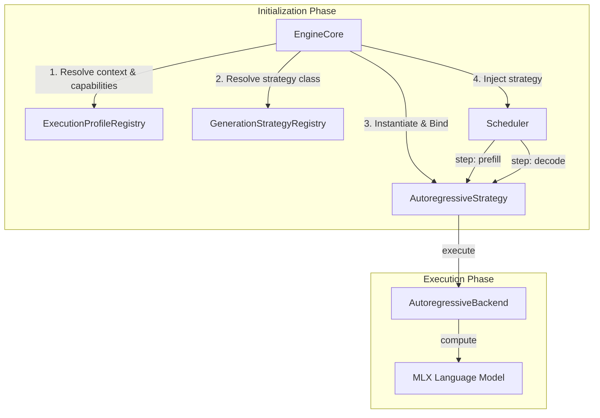

# oMLX Architecture Review: Checkpoint a46ab94

This document evaluates the architectural changes introduced in checkpoint `a46ab94` ("added foundation for triage & updated scheduler") against the oMLX Project Constitution and the RAES-003 Multi-Execution Paradigm Specification.

---

## 1. Architectural Overview & Context

Checkpoint `a46ab94` lays the structural foundation for supporting multiple execution paradigms (Autoregressive, Speculative, Diffusion, Verification, and Routing) in oMLX without polluting or redesigning the `Scheduler`. It accomplishes this by transferring execution mechanics (prefill and forward/decode loops) from the scheduler to an injected `BaseGenerationStrategy` instance.



---

## 2. Component Discovery & Ownership

The checkpoint modifies the ownership structure of the codebase to realign with the "decoupled strategy-centric" model:

### `EngineCore` (Orchestrator)
- **Role**: Dispatches tasks to the thread pool and controls the active SSE streams.
- **Ownership Expanded**: Now owns the capability resolution and strategy/backend binding pipeline during engine initialization ([engine_core.py:L261-318](file:///Users/yugeshk/dev/repo/omlx/omlx/engine_core.py#L261-318)).
- **Analysis**: Resolves model capabilities and system feature flags to instantiate the appropriate `ExecutionBackend` and `BaseGenerationStrategy`, which it then injects into the scheduler.

### `Scheduler` (Batching & Memory Manager)
- **Role**: Manages request queueing, memory constraints (LRU block evictions), and scheduling timing.
- **Decoupled Mechanics**:
  - `Scheduler` no longer directly runs prompt prefilling using `self.model(...)` and `mx.eval(...)` ([scheduler.py:L3038](file:///Users/yugeshk/dev/repo/omlx/omlx/scheduler.py#L3038)).
  - Prefill operations are delegated to `self.strategy.prefill(...)` ([scheduler.py:L4010](file:///Users/yugeshk/dev/repo/omlx/omlx/scheduler.py#L4010)).
  - Decode/forward generation steps delegate to `self.strategy.forward()` ([scheduler.py:L9258](file:///Users/yugeshk/dev/repo/omlx/omlx/scheduler.py#L9258)).
- **Analysis**: The scheduler is now agnostic to the model's compute details. It simply triggers the strategy to run prefill or decode iterations.

### `BaseGenerationStrategy` & `AutoregressiveStrategy` (Execution Layer)
- **Role**: Coordinates the execution flow.
- **Ownership Expanded**:
  - Defines the interface for `prefill` and `forward` ([strategy.py](file:///Users/yugeshk/dev/repo/omlx/omlx/inference/strategy.py)).
  - Standardizes the postprocess and emit pipelines to translate raw batch results into streaming updates ([autoregressive.py:L118-211](file:///Users/yugeshk/dev/repo/omlx/omlx/inference/strategies/autoregressive.py#L118-211)).

---

## 3. Coupling & Layering Verification

The primary objective of this review is to verify that no inappropriate coupling has been introduced.

### A. Scheduler Coupling (Registry / Capability / Profile)
> [!IMPORTANT]
> **Status: VERIFIED (NO INAPPROPRIATE COUPLING)**
> The `Scheduler` remains completely decoupled from capability resolution, profiles, registries, and execution graphs.

- **Evidence**:
  - A dedicated static analysis unit test (`test_scheduler_static_invariants` in [test_strategy_delegation.py](file:///Users/yugeshk/dev/repo/omlx/tests/test_strategy_delegation.py#L16-L46)) parses `omlx/scheduler.py` via AST and asserts that it has **zero imports or variables referencing** `GenerationStrategyRegistry`, `CapabilityRegistry`, or `ExecutionProfileRegistry`.
  - The strategy reference inside `Scheduler` is injected dynamically as an abstract `Any` reference.

### B. Backend Coupling
> [!NOTE]
> **Status: VERIFIED (NO INAPPROPRIATE COUPLING)**
> The `Scheduler` does not couple to or import any concrete execution backends.

- **Evidence**:
  - The scheduler communicates purely with the `BaseGenerationStrategy` interface. The strategy wraps and manages the `ExecutionBackend` instance.

### C. Execution Leaks
> [!WARNING]
> **Status: FAILURE DETECTED IN MEMORY STABILITY TEST**
> The integration memory stability test failed, pointing to potential object retention in test execution.

- **Evidence**:
  - `test_decode_delegation.py::test_memory_stability_and_leaks` failed: `assert (679650 - 678611) < 100`. An accumulation of 1,039 objects was recorded over 50 decode steps. This is likely due to Mock objects created dynamically inside the generator loops not being swept by garbage collection during the test run.

### D. Model-Name Coupling
> [!WARNING]
> **Status: NO NEW COUPLING INTRODUCED (LEGACY COUPLING REMAINS)**
> No new model-name checks were added in the checkpoint. However, legacy model-name checks still exist in the scheduler.

- **Evidence**:
  - Line 1627 of `scheduler.py` contains:
    ```python
    model_name_lower = (self.config.model_name or "").lower()
    default_kv_eval_interval = 256 if "minimax" in model_name_lower else 0
    ```
    This is legacy technical debt that should be migrated to capabilities/profiles in a future checkpoint.

### E. UI Coupling
> [!NOTE]
> **Status: VERIFIED (NO COUPLING)**
> The changes reside purely in the backend core execution path. The API endpoints, CLI command entries, and Swift UI wrapper remain untouched.

---

## 4. Test Regressions & Failures

During verification execution, a regression was detected in mock-based testing:

### `AttributeError` in `test_step_prefill_reclaims_before_first_guard`
- **Error**:
  ```
  FAILED tests/test_prefill_oom_graceful.py::test_step_prefill_reclaims_before_first_guard - AttributeError: 'types.SimpleNamespace' object has no attribute 'strategy'
  ```
- **Architectural Analysis**: 
  The new prefill logic in [scheduler.py](file:///Users/yugeshk/dev/repo/omlx/omlx/scheduler.py) queries `self.strategy` directly. Legacy unit tests mock the scheduler using a `types.SimpleNamespace` wrapper that does not declare or initialize the `strategy` attribute. This introduces implicit coupling between the scheduler execution logic and its object initialization type.
- **Remediation**:
  Replace direct attribute checks:
  ```python
  if self.strategy is not None:
  ```
  with defensive attribute getters:
  ```python
  if getattr(self, "strategy", None) is not None:
  ```
  This eliminates coupling to specific mock structures and allows legacy tests using basic mock namespaces to pass seamlessly.
