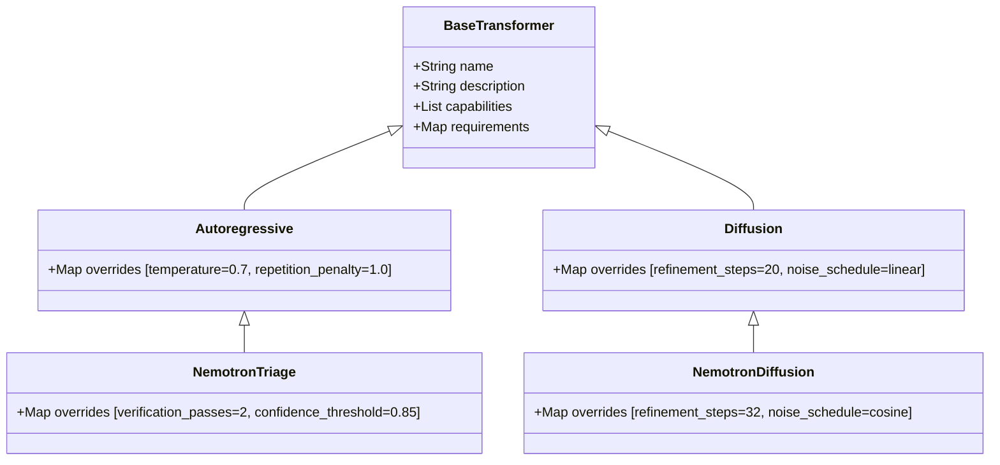
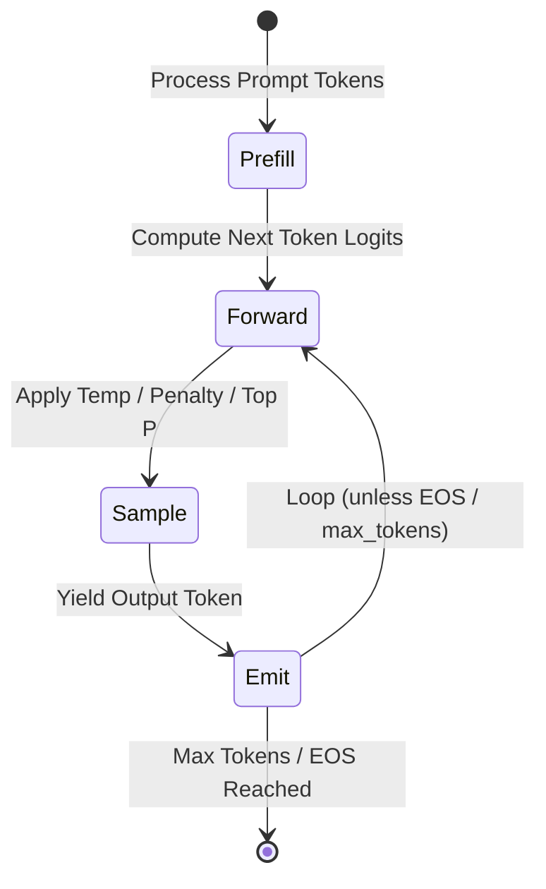
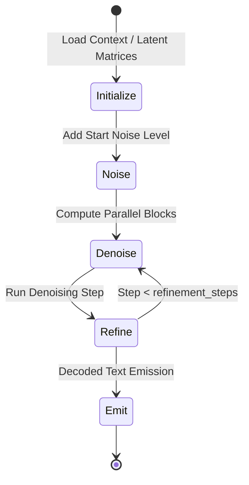
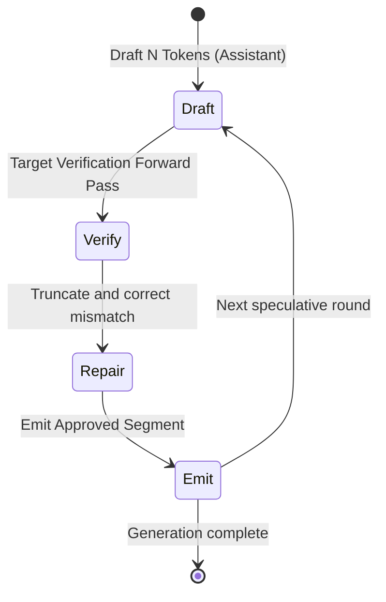
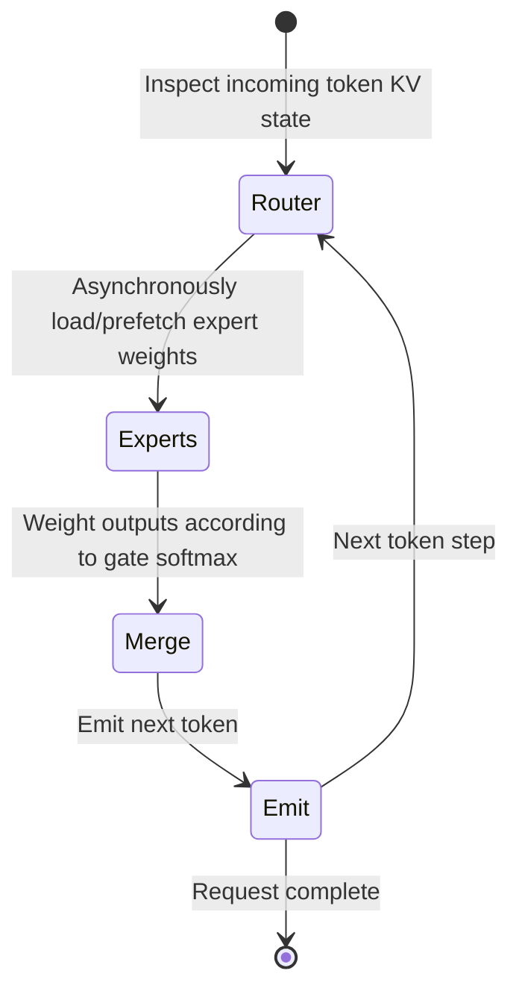

# D1.3 & D1.4: Execution Modes

This document specifies the execution profiles, their inheritance model, and the execution topologies governing the operational pipeline.

---

## D1.3: Execution Profile & Inheritance

To eliminate duplication across configurations, execution profiles support **inheritance**. A base profile establishes standard baseline values, while downstream engines and model architectures inherit and override only the attributes they need to customize.



### JSON Profile Registry Definition

```json
{
  "profiles": [
    {
      "name": "base_transformer",
      "description": "Baseline parameters for all transformer architectures",
      "parent": null,
      "capabilities": [],
      "platform_requirements": {
        "min_unified_memory_gb": 8
      },
      "overrides": {}
    },
    {
      "name": "autoregressive",
      "description": "Causal autoregressive generation profile",
      "parent": "base_transformer",
      "capabilities": ["autoregressive"],
      "platform_requirements": {},
      "overrides": {
        "autoregressive.temperature": 0.7,
        "autoregressive.top_p": 0.9,
        "autoregressive.repetition_penalty": 1.0
      }
    },
    {
      "name": "diffusion",
      "description": "Baseline diffusion-denoising profile",
      "parent": "base_transformer",
      "capabilities": ["diffusion"],
      "platform_requirements": {
        "requires_bidirectional_attention": true,
        "requires_block_mask": true
      },
      "overrides": {
        "diffusion.refinement_steps": 20,
        "diffusion.noise_schedule": "linear"
      }
    },
    {
      "name": "nemotron_diffusion",
      "description": "Customized profile for Nemotron Labs iterative refinement models",
      "parent": "diffusion",
      "capabilities": ["diffusion"],
      "platform_requirements": {
        "min_unified_memory_gb": 16
      },
      "overrides": {
        "diffusion.refinement_steps": 32,
        "diffusion.noise_schedule": "cosine"
      }
    },
    {
      "name": "nemotron_triage",
      "description": "Accelerated autoregressive profile utilizing triage draft-verification",
      "parent": "autoregressive",
      "capabilities": ["autoregressive", "triage"],
      "platform_requirements": {
        "min_unified_memory_gb": 16,
        "requires_block_mask": true
      },
      "overrides": {
        "triage.verification_passes": 2,
        "triage.confidence_threshold": 0.85
      }
    }
  ]
}
```

---

## D1.4: Runtime Configuration vs. Runtime State

To maintain clean architecture, we enforce a strict separation between **Configuration** (static settings supplied by a user or profile) and **Runtime State** (ephemeral parameters generated during execution). 

*   Only **Configuration** variables are saved to persistence layer, updated via the UI, or passed through user profiles.
*   **Runtime State** variables are kept entirely in-memory within the `ExecutionPipeline` or `ExecutionEngine` instance, updating at each token step.

| Dimension | Configuration (Persistent & Editable) | Runtime State (In-Memory & Read-Only) |
| :--- | :--- | :--- |
| **Persistence** | Saved to `model_settings.json` and `model_profiles.json` | Transient; discarded on request end or engine unload |
| **Modifiability**| Modified by user input, CLI flags, or API requests | Modified by execution compute kernels/calculators |
| **Examples** | `temperature`, `top_p`, `refinement_steps`, `expert_budget` | `active_experts`, `loaded_adapter`, `routing_cache`, `noise_schedule`, `current_refinement_iteration` |

---

## Execution Topologies

The **Execution Topology** defines the sequence of execution stages. When an `ExecutionBackend` instantiates an `ExecutionPipeline`, it constructs it around the topology of the selected execution profile.

### 1. Autoregressive Topology
Evaluates prompts in a single batch prefill pass, then enters a loop of generation, sampling, and output emission.



### 2. Diffusion Topology
Pre-loads attention matrices, initializes noisy outputs, and loops through sequential denoiser block evaluations before final output generation.



### 3. Triage (Speculative Decoding) Topology
Drafts token sequences using a cheap assistant, passes candidate sequences to the verification model, repairs any rejected steps, and emits confirmed segments.



### 4. Streaming MoE Topology
Tokens pass through a router to load appropriate expert weights asynchronously, perform forward computations, merge outputs, and emit values.


