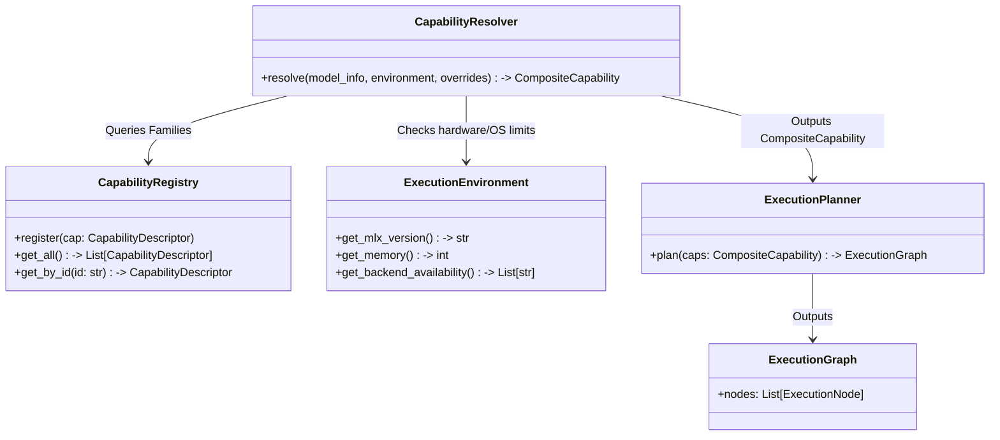
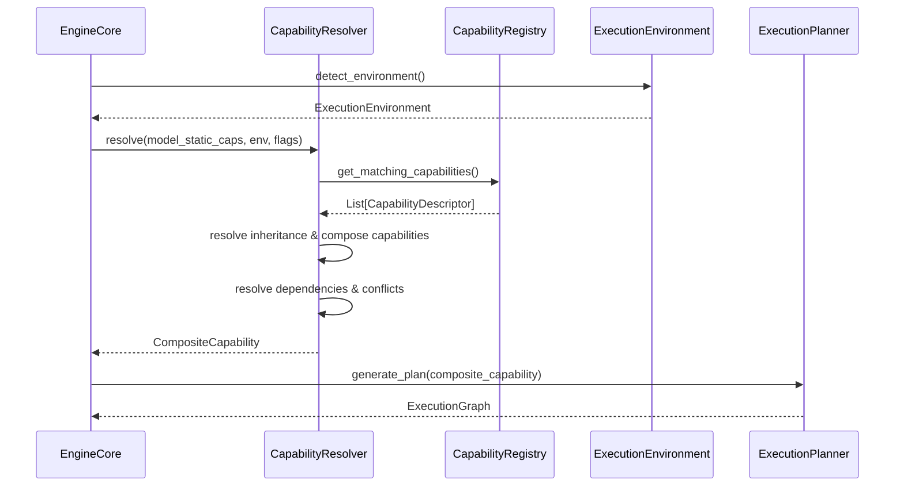

# RAES-008: Runtime Capability Registry & Capability Resolution

## 1. Repository Audit

A comprehensive audit of the codebase has been conducted to locate where execution decisions, backend selection, and capability inferences are currently hardcoded.

### Hardcoded Locations Identified
- **`omlx/runtime/capabilities.py`**:
  - `ModelCapabilities`, `EngineCapabilities`, and `ActualCapabilities` are static dataclasses with hardcoded boolean flags (`supports_diffusion`, `supports_linear_speculation`, etc.).
  - `ActualCapabilities.resolve` uses manual, hardcoded `and` combinations to intersect model, engine, and feature flags.
  - `infer_capabilities` relies on hardcoded string matching (`if "diffusion" in model_type or model_type == "nemotron_labs_diffusion":`).
- **`omlx/inference/execution_profile.py`**:
  - `_default_resolver` contains hardcoded mapping from model types to backend profiles.
  - `ExecutionProfileRegistry.resolve` contains hardcoded capability negotiation (fallback logic from diffusion/linear_speculation to autoregressive).
  - Backend factories (`_autoregressive_factory`, `_experimental_nemotron_factory`) are hardcoded at module initialization.
- **`omlx/registry/model_info.py`**:
  - `build_model_info` contains static, hardcoded logic for setting modes and attention types based on specific capability boolean flags.
- **`omlx/registry/capability_registry.py`**:
  - `GenerationStrategyRegistry.resolve_mode` applies hardcoded fallback logic.
  - `register_default_strategies` is hardcoded.
- **`omlx/engine_core.py`**:
  - Combines capabilities, configures the context, resolves the execution profile, and builds the strategy registry inline.

## 2. Architecture Review

The current architecture is highly coupled to specific generation modes via boolean fields and `if/else` statements.

**Goal**: Move to a declarative registry where capabilities are registered, discovered, and resolved via a generic `ResolutionEngine`. This insulates core components from execution logic and establishes a clean, cohesive abstraction chain:

```text
Model
   ↓
Model Adapter
   ↓
Capability Resolver
   ↓
Execution Planner
   ↓
Execution Graph
   ↓
Generation Strategy
   ↓
Execution Backend
   ↓
Execution Pipeline
   ↓
Execution Engine
   ↓
MLX Runtime
```

## 3. Capability Descriptor Design

The registry will handle dynamic registration of capabilities using a `CapabilityDescriptor`. Rather than a flat list of boolean fields, capabilities describe execution characteristics.

Capabilities are divided into two distinct domains:

### 3.1. Static Capabilities
Declared by the model itself, these never change.
- `supports_diffusion`, `supports_vision`, `supports_MoE`
- `attention_type` (causal, bidirectional)

### 3.2. Runtime Capabilities
Resolved dynamically per-execution based on the environment and request.
- `metal_available`, `memory_limits`, `batch_size`
- `cache_implementation`, `execution_mode`, `verification_enabled`

### 3.3. The Descriptor
```python
@dataclass
class VerificationDescriptor:
    # Verification is metadata about a capability, not a separate registry
    verification_passes: list[str]
    # e.g., ["n_gram_match", "model_evaluator"]

@dataclass
class CapabilityDescriptor:
    id: str
    display_name: str
    description: str

    # Capability Families
    family: str  # e.g., "architecture", "execution", "hardware", "verification", "scheduling", "memory", "streaming", "plugins"

    # Execution Properties (answering "Does this use X?")
    execution_family: str       # e.g., "autoregressive", "diffusion"
    attention_type: str         # e.g., "causal", "bidirectional", "iterative_refinement"
    cache_type: str             # e.g., "paged_ssd", "standard_kv"
    scheduler_hints: list[str]  # e.g., ["chunked_prefill"]
    execution_graph: str        # e.g., "standard_transformer"
    backend: str                # e.g., "autoregressive_backend"
    pipeline: str               # e.g., "transformer_pipeline"
    engine: str                 # e.g., "transformer_execution_engine"
    adapter: str                # e.g., "llama_adapter"

    # Metadata & Resolution
    verification_profile: VerificationDescriptor | None
    hardware_profile_requirements: dict[str, Any]
    dependencies: list[str] = field(default_factory=list)
    conflicts: list[str] = field(default_factory=list)
    inherits_from: str | None = None  # e.g., "transformer"
    priority: int = 0
```

## 4. Capability Families, Composition, & Inheritance

Instead of one flat registry, capabilities are organized into **Capability Families** to remain manageable as the system grows:
* Architecture
* Execution
* Hardware
* Verification
* Scheduling
* Memory
* Streaming
* Plugins

### Capability Inheritance

The registry supports inheritance to define hierarchical capabilities without duplicating base descriptors:
```text
Transformer
    ↓
Autoregressive
    ↓
Speculative
    ↓
Triage
```
And:
```text
Transformer
    ↓
Diffusion
    ↓
Image Diffusion
```

### Capability Composition

The `CapabilityResolver` composes fundamental capabilities into Composite Capabilities at runtime, avoiding an explosion of registered permutations.

Example 1: Streaming MoE
```text
Transformer + Streaming + MoE  ->  Streaming MoE Runtime
```

Example 2: Nemotron Triage
```text
Transformer + Diffusion + Verification  ->  Nemotron Triage Runtime
```

## 5. Resolution Engine Design

The `CapabilityResolver` composes and resolves runtime components dynamically.

**Inputs**:
1. Static Capabilities (Model Metadata)
2. `ExecutionEnvironment` (formerly Hardware registry)
   - *Includes: MLX version, Metal version, unified memory, CPU, OS, backend availability, custom kernels, quantization support.*
3. User Overrides (Feature flags)

**Process**:
1. Query registries across all Capability Families.
2. Filter capabilities against the `ExecutionEnvironment`.
3. Resolve dependencies, remove conflicts (topological sort), and flatten inheritance chains.
4. Perform Capability Composition (e.g., `Transformer` + `MoE` + `Streaming`).
5. Output the resolved `CompositeCapability` to the `ExecutionPlanner`.
6. `ExecutionPlanner` consumes the resolved capabilities and emits an `ExecutionGraph`.

## 6. Diagrams

### 6.1. Registry Relationships


### 6.2. Initialization Flow


## 7. Files To Modify

- **NEW `omlx/runtime/capability_registry.py`**: Defines `CapabilityDescriptor`, `VerificationDescriptor`, and family-partitioned registries.
- **NEW `omlx/runtime/resolver.py`**: Implements the `CapabilityResolver` (graph resolution, static vs runtime composition, inheritance).
- **NEW `omlx/runtime/environment.py`**: Manages the `ExecutionEnvironment` (hardware, OS, MLX version).
- **MODIFIED `omlx/runtime/capabilities.py`**: Deprecate hardcoded boolean dataclasses in favor of dynamic resolution.
- **MODIFIED `omlx/inference/execution_profile.py`**: Retained/modified as part of the `ExecutionPlanner`'s output, removing old fallback logic.
- **MODIFIED `omlx/registry/model_info.py`**: Remove hardcoded capability checks.
- **MODIFIED `omlx/engine_core.py`**: Update initialization to use the new `CapabilityResolver` -> `ExecutionPlanner` pipeline.

## 8. Risk Analysis

- **Cyclic Dependencies**: Capability inheritance or dependencies could create cycles (e.g., A depends on B, B depends on A). The `CapabilityResolver` must implement topological sorting and cycle detection to fail fast during resolution.
- **Startup Latency**: Dynamically resolving capabilities, resolving inheritance chains, and evaluating hardware could increase `EngineCore` initialization time. The resolver results should be cached per `model_info` configuration.
- **Registration Ordering**: If plugins or capabilities are registered in non-deterministic orders, resolution could fail. The registry must enforce lazy resolution (evaluate after all registrations are complete).
- **Plugin Loading**: External plugins could inject malformed capabilities or crash the initialization phase. The registry must implement strict validation on capability definitions.
- **Future Compatibility**: Modifying `EngineCore` logic might break external tools using older SDKs. The resolved structures should expose legacy properties as computed properties to maintain backwards compatibility in the short term.
- **Verification Implications**: Testing combinatorial capabilities requires exponential test cases. We must rely on `VerificationDescriptor` passes to test the most common composed capabilities rather than enumerating all permutations.

## 9. Verification Plan

1. **Family Registration**: Verify capabilities can be registered under specific families (Architecture, Execution, Streaming, etc.).
2. **Inheritance & Composition Correctness**: Tests to verify capability inheritance (Autoregressive inherits from Transformer) and composition (Transformer + Streaming + MoE correctly synthesizes into a composite descriptor).
3. **Static vs Runtime Separation**: Ensure static capabilities from the model dictate which runtime capabilities can be composed.
4. **Environment Resolution**: Verify `ExecutionEnvironment` correctly restricts capabilities based on MLX version, memory, and custom kernels.
5. **Execution Planner Consumes Capabilities**: Validate that the resolved capability descriptor successfully maps to a planned `ExecutionGraph`.

## 10. Rollback Plan

- **Version Control**: Work will be done in a feature branch.
- **Feature Flag**: Introduce a feature flag `OMLX_USE_NEW_RESOLVER` (default to False initially) to allow side-by-side execution if needed.
- **Reversion**: If the new resolver causes regressions, toggle the flag or revert the branch.

## 11. Recommendation for the Implementation Checkpoint

We recommend proceeding with **RAES-008 Checkpoint 1: Capability Registry & Environment Foundation**:
* **Goal**: Implement `CapabilityDescriptor`, `ExecutionEnvironment`, and the partitioned `CapabilityRegistry`.
* **Purpose**: Establish the core data structures and ensure they can resolve inheritance, dependencies, conflicts, and basic composition through tests.
* **Allowed Files**: `omlx/runtime/capability_registry.py`, `omlx/runtime/resolver.py`, `omlx/runtime/environment.py`, `tests/test_capability_registry.py`.
* **Forbidden Files**: `omlx/engine_core.py`, `omlx/scheduler.py`.
* **Exit Criteria**: Registry, environment detection, and resolver logic is implemented and passes unit tests covering inheritance, composition, and static/runtime boundaries.
