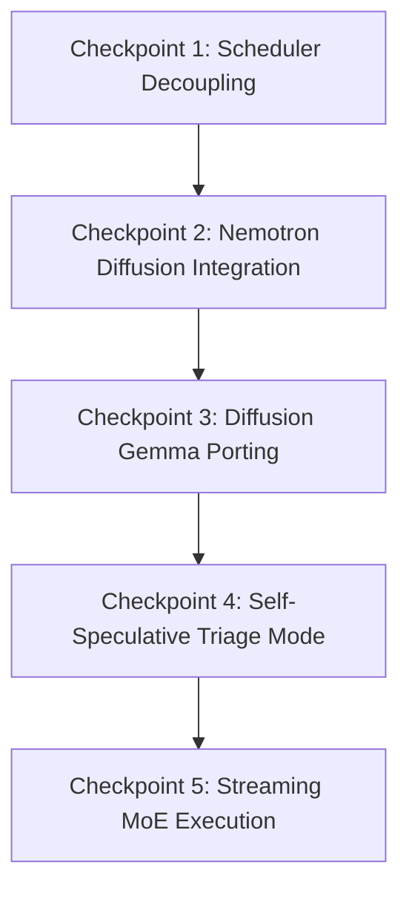

# Implementation Roadmap & Architecture Gaps

This document defines the exact repository components that must evolve (Architecture Gaps) and the sequential checkpoints to execute the migration.

---

## 1. Repository Architecture Gaps

| Component | Target Evolution | Impacted Files | Gaps & Evidence |
| :--- | :--- | :--- | :--- |
| **Scheduler** | Decouple from `BatchGenerator` and VLM MTP decode step. Delegate prefill and decode execution to `strategy.prefill(...)` and `strategy.forward(...)`. | • [omlx/scheduler.py](file:///Users/yugeshk/dev/repo/omlx/omlx/scheduler.py) | • `Scheduler` instantiates `BatchGenerator` directly in [L2556](file:///Users/yugeshk/dev/repo/omlx/omlx/scheduler.py#L2556). • Prefill uses model forward passes directly in [L2864](file:///Users/yugeshk/dev/repo/omlx/omlx/scheduler.py#L2864). • Decoupled scheduler must be execution-agnostic. |
| **Model Capabilities** | Introduce capability flags for triage/self-speculation, verification, and streaming MoE. | • [omlx/runtime/capabilities.py](file:///Users/yugeshk/dev/repo/omlx/omlx/runtime/capabilities.py) | • `ModelCapabilities` [L18-L30](file:///Users/yugeshk/dev/repo/omlx/omlx/runtime/capabilities.py#L18-L30) only supports basic autoregressive, diffusion, linear speculation, and MTP. • `infer_capabilities` [L85-L115](file:///Users/yugeshk/dev/repo/omlx/omlx/runtime/capabilities.py#L85-L115) does not resolve triage/hybrid capabilities. |
| **Execution Profile Registry**| Map triage, streaming MoE, and diffusion Gemma to execution profiles. | • [omlx/inference/execution_profile.py](file:///Users/yugeshk/dev/repo/omlx/omlx/inference/execution_profile.py) | • `_default_resolver` [L104-L119](file:///Users/yugeshk/dev/repo/omlx/omlx/inference/execution_profile.py#L104-L119) defaults to `autoregressive` or stub `diffusion`. Needs triage and MoE resolvers. |
| **Model Adapter** | Extend adapter to support dynamic attention mask swapping (Causal vs Block-Diagonal). | • [omlx/models/adapters/nemotron_adapter.py](file:///Users/yugeshk/dev/repo/omlx/omlx/models/adapters/nemotron_adapter.py) | • `NemotronModelAdapter` [L14-L86](file:///Users/yugeshk/dev/repo/omlx/omlx/models/adapters/nemotron_adapter.py#L14-L86) holds a static `_is_diffusion_mode` state. Must support runtime toggles for hybrid self-speculation cycles. |
| **VLM Engine** | De-serialize Diffusion Gemma and run it on the scheduler loop. | • [omlx/engine/vlm.py](file:///Users/yugeshk/dev/repo/omlx/omlx/engine/vlm.py) | • `VLMBatchedEngine.generate` [L2801-L2832](file:///Users/yugeshk/dev/repo/omlx/omlx/engine/vlm.py#L2801-L2832) uses single-request serial lock bypass. Must route through standard strategy pipelines. |
| **Strategies** | Implement full scheduling step logic in `DiffusionStrategy` and speculative stubs. | • [omlx/inference/strategies/diffusion.py](file:///Users/yugeshk/dev/repo/omlx/omlx/inference/strategies/diffusion.py) • [omlx/inference/strategies/linear_speculation.py](file:///Users/yugeshk/dev/repo/omlx/omlx/inference/strategies/linear_speculation.py) | • `DiffusionStrategy.prefill` [L76](file:///Users/yugeshk/dev/repo/omlx/omlx/inference/strategies/diffusion.py#L76) raises `NotImplementedError`. `forward` is an empty list return. |

---

## 2. Checkpoint Roadmap

### Checkpoint 1: Scheduler Decoupling via Strategy Delegation
*   **Goal**: Refactor the scheduler step loop to delegate model execution (prefill/forward) to the bound strategy instance.
*   **Allowed Files**:
    *   `omlx/scheduler.py`
    *   `omlx/inference/strategy.py`
    *   `omlx/inference/strategies/autoregressive.py`
*   **Forbidden Files**:
    *   Any file under `omlx/models/` or `omlx/engine/`
*   **Dependencies**: None.
*   **Verification**: Assert that standard autoregressive outputs and continuous batching tests (`pytest tests/test_vlm_mtp.py`, `pytest tests/test_prefill_delegation.py`) function identically.
*   **Rollback Plan**: Revert scheduler delegation calls back to direct `self.batch_generator` and `self.model` executions.
*   **Exit Criteria**: Scheduler loop compiles, routes AR cycles through `AutoregressiveStrategy`, and passes all existing tests.
*   **Risk Level**: High (core path modified).

### Checkpoint 2: Nemotron Diffusion Integration
*   **Goal**: Expose full diffusion scheduling steps through the decoupled `DiffusionStrategy` and `ExperimentalNemotronBackend`.
*   **Allowed Files**:
    *   `omlx/inference/strategies/diffusion.py`
    *   `omlx/inference/backends/experimental_diffusion_backend.py`
*   **Forbidden Files**:
    *   `omlx/scheduler.py`
*   **Dependencies**: Checkpoint 1.
*   **Verification**: Run `pytest tests/test_experimental_diffusion.py` and verify end-to-end execution of refinement cycles.
*   **Rollback Plan**: Disable `experimental_nemotron` profile registration.
*   **Exit Criteria**: Diffusion decoding executes and outputs block-refined tokens through the strategy loop.
*   **Risk Level**: Low.

### Checkpoint 3: Diffusion Gemma Porting
*   **Goal**: Port Diffusion Gemma from the VLM-specific thread bypass to the unified strategy and backend pipeline.
*   **Allowed Files**:
    *   `omlx/engine/vlm.py`
    *   `omlx/inference/backends/experimental_diffusion_backend.py` (or a dedicated gemma backend)
*   **Forbidden Files**:
    *   `omlx/scheduler.py`
*   **Dependencies**: Checkpoint 2.
*   **Verification**: Run Gemma 4 diffusion and block completions; verify they execute without acquiring the serial `_diffusion_lock`.
*   **Rollback Plan**: Revert `vlm.py` generate branch back to `_stream_diffusion_inputs`.
*   **Exit Criteria**: Diffusion Gemma runs on the general scheduler pipeline with concurrent request queues.
*   **Risk Level**: Moderate.

### Checkpoint 4: Self-Speculative / Triage Mode
*   **Goal**: Implement `TriageStrategy` and `TriageBackend` enabling Nemotron's self-speculation mode (diffusion drafting + AR verification).
*   **Allowed Files**:
    *   `omlx/models/adapters/nemotron_adapter.py`
    *   `omlx/inference/strategies/triage.py` (New file)
    *   `omlx/inference/backends/triage_backend.py` (New file)
*   **Forbidden Files**:
    *   `omlx/scheduler.py`
*   **Dependencies**: Checkpoint 3.
*   **Verification**: Assert that the adapter successfully swaps masking between causal and block-diagonal modes during forward passes; verify draft tokens are verified and accepted.
*   **Rollback Plan**: Delete triage strategies and fall back to pure autoregressive.
*   **Exit Criteria**: Nemotron-Labs-Diffusion-3B runs self-speculation cycles on the unified scheduler.
*   **Risk Level**: Moderate.

### Checkpoint 5: Streaming MoE Execution
*   **Goal**: Implement `StreamingMoeStrategy` and dynamic expert caching/paging mechanisms.
*   **Allowed Files**:
    *   `omlx/inference/strategies/streaming_moe.py` (New file)
    *   `omlx/cache/` (caching policy changes)
*   **Forbidden Files**:
    *   `omlx/scheduler.py`
*   **Dependencies**: Checkpoint 4.
*   **Verification**: Run MoE benchmarks and measure peak process-memory usage under memory ceilings.
*   **Rollback Plan**: Revert to static monkey-patched routing.
*   **Exit Criteria**: Large Mixture-of-Experts models load and stream tokens with bounded, active-expert memory footprints.
*   **Risk Level**: High.
